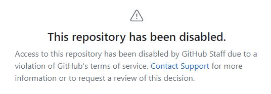

#### 各位低调使用！！！

> 最近两个星期 `fork` 了五六十，增长太快，可能被注意到，所以`disabled`了，唉~

## 描述

1. 多个Cookie之间采用`\n`分割，即一行一个
2. 【可选】消息推送只有 pushplus

## 使用

1.设置secret
`Settings`-->`Secrets and variables`-->`Actions`-->`New repository secret`

| 名称             | 值                |
|----------------|------------------|
| COOKIE         | 你在那个网站抓到的 cookie |
| PUSHPLUS_TOKEN | Pushplus的token   |

2.依次点击`Actions`-->`run`-->`Run workflow`-->`Run workflow`以激活Actions

## 日志

> 2023年8月15日21:34:34 更新
>
> 2023年7月29日13:48:28 更新

